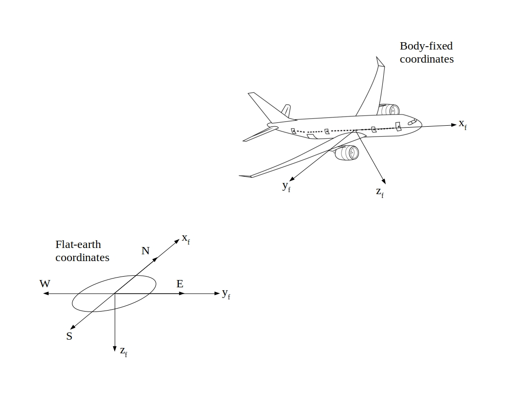

# Input Files
The basic input file for MachUp contains a JSON object which describes the scene and which aircraft are in the scene, along with the state of those aircraft in the scene. A separate JSON object is used to specify the geometry and controls of each aircraft. These aircraft objects can reference other files that store information on airfoil properties, chord distributions, sweep, etc., as will be discussed. At a minimum, two JSON objects will be created by the user, a scene object and an aircraft object.

## JSON Format
The basic structure of a JSON object is a set of key-value pairs, analogous to a Python dictionary. Examples can be found in the examples/ directory. The following sections describe the structure of the JSON objects used to interface with MachUp. Only one JSON object is specified per .json file. When using the JSON objects, only the scene object is passed to MachUp. As long as the paths to all other JSON objects are properly specified in the scene object, MachUp will automatically load all other required objects.

## Units
MachUp allows the user to specify the units for each value if they desire. For float values, this is done by making the value a list where the first element is the actual value and the second element is a string specifying the units. For example:

    "area" : [6.75, "ft^2"]

For vector inputs, such as position and velocity, the units are simply appended to the vector:

    "velocity" : [100.0, 13.0, 0.0, "ft/s"]

For array inputs, such as a density profile or chord distribution, the units are appended as another row in the array:

    "rho" : [[0.0, 1.225],
             [2000.0, 1.0066],
             [4000.0, 0.81935],
             ["m", "kg/m^3"]]

When specifying column units in files, these are also appended as another row:

    # File: density_profile.csv
    0.0, 1.225,
    2000.0, 1.0066,
    4000.0, 0.81935,
    "m", "kg/m^3"

The following measurements can be defined with the accompanying units:

| Measurement                   | Acceptable Units                  |
| ----------------------------- | --------------------------------- |
| Position/displacement/length: | "ft", "m", "in", "cm"             |
| Area:                         | "ft^2", "m^2"                     |
| Velocity:                     | "ft/s", "m/s", "mph", "kph", "kn" |
| Angular deflection/position:  | "deg", "rad"                      |
| Angular rate:                 | "deg/s", "rad/s"                  |
| Density:                      | "slug/ft^3", "kg/m^3"             |
| Weight/Force:                 | "lbf", "N"                        |
| Moment:                       | "ft lbf", "Nm"                    |
*Note the carat is required in units containing powers. Otherwise, MachUpX will not recognize the unit specification.*

Except for angular measurements, the first unit listed is the default for "English" units. The second is the default for "SI". For angular measurements of state and control deflections, as well as airframe geometry, the default is always degrees. For airfoil parameters, measurements may only be expressed in radians. When specifying units in an array and one of the measurements is dimensionless (e.g. span fraction), "-" should be used. Any results generated by MachUpX will be output in the default unit for the given system, regardless of how units were specified for the inputs.

## Coordinate Systems
Throughout MachUpX, two coordinate systems are used. These are the body-fixed and earth-fixed coordinate systems. In the body-fixed coordinate system, the x-axis points forward out of the nose of the aircraft, the y-axis points to the right along the wing, and the z-axis points down. The body-fixed coordinate system has its origin at the aircraft's center of gravity.

In the earth-fixed coordinate system, the x-axis points North, the y-axis points East, and the z-axis points down. The origin of the earth-fixed coordinate system is somewhat arbitrary, but it is assumed to be at sea level. In this coordinate system, the earth is assumed to be flat.



## Scene Object
The following are keys which can be specified in the scene JSON object. NOTE: all keys not marked as optional are required. Key names typed in all capitals between carats (e.g. <KEY_VALUE>) are to be deterimined by the user.

>**"tag" : string, optional**
>>A note on the specific input. Does not affect execution.
>>
>**"run" : dict, optional**
>>Gives the analyses MachUp is to run. This must be specified if the input file is being passed as a command line argument to MachUp. Otherwise, MachUp will return without performing any calculations. If this input file is being given to the API, this does not affect execution.
>>
>>**"forces" : dict, optional**
>>>Calculates the aerodynamic forces and moments on the aircraft at the current state.
>>>
>>>**"filename" : string, optional**
>>>>File to store the results in. Defaults to the input filename + "_forces".
>>>
>>>**"dimensional" : boolean, optional**
>>>>Whether results should include dimensional forces and moments. Defaults to true.
>>>
>>>**"non_dimensional" : boolean, optional**
>>>>Whether results should include nondimensional coefficients. Defaults to true.
>>>
>>>**"verbose" : boolean, optional**
>>>>Defaults to false
>>
>>**"display_wireframe" : dict, optional**
>>>Displays a wireframe of the geometry of the scene/aircraft.
>>>
>>>**"show_legend" : boolean, optional**
>>>>If set to true, a legend will be included with the wireframe detailing which color corresponds to which wing segment. Defaults to false.
>>>
>>>**"filename" : str, optional**
>>>>File to save an image of the wireframe to. If specified, the wireframe will not be automatically displayed. If not specified, the wireframe will display to the user, after which it can be manually saved.
>>
>>**"aero_derivatives" : dict, optional**
>>>Calculates the stability, damping, and control derivatives at the current state.
>>>
>>>**"aircraft" : list, optional**
>>>>The aircraft to calculate the derivatives of. Defaults to all aircraft in the scene.
>>>
>>>**"filename" : string, optional**
>>>>File to store the results in. Defaults to the input filename + "_derivatives".
>>>
>>**"distributions" : dict, optional**
>>>Gives the distribution of various parameters across each lifting surface.
>>>
>>>**"filename" : string, optional**
>>>>File to store the results in. Defaults to the input filename + "_derivatives".
>>>
>>>**"make_plots" : list, optional**
>>>>List of parameters to make plots of. A plot of the parameter as a function of span fraction for each wing segment will then be generated and saved. The following params can be listed for making plots: "cpx", "cpy", "cpz", "chord", "twist", "dihedral", "sweep", "area", "alpha", "Re", "M", "section_CL", "section_Cm", "section_parasitic_CD", and "section_aL0".
>>
>>**"pitch_trim" : dict, optional**
>>>Trims the aircraft in pitch. THIS SHOULD ONLY BE USED IN THE CASE OF ONE AIRCRAFT IN THE SCENE AND NO WIND.
>>>
>>>**"pitch_control" : str, optional**
>>>>The name of the control that should be used to trim in pitch. Defaults to "elevator".
>>>
>>>**"filename" : string, optional**
>>>>File to store the results in. Defaults to the input filename + "_pitch_trim".
>>>
>>>**set_trim_state : bool, optional**
>>>>If set to True, once trim is determined, the state of the aircraft will be set to this trim state. If False, the state of the aircraft will return to what it was before this method was called. Defaults to True.
>>>
>>>**verbose : bool, optional**
>>>>If set to true, information will be output about the progress of Newton's method. Defaults to False.
>>
>>**"aero_center" : dict, optional**
>>>Calculates the location of the aerodynamic center at the current state.
>>>
>>>**"aircraft" : list, optional**
>>>>The aircraft to calculate the aerodynamic centers of. Defaults to all aircraft in the scene.
>>>
>>>**"filename" : string, optional**
>>>>File to store the results in. Defaults to the input filename + "_aero_center".
>>>
>>>**"verbose" : boolean, optional**
>>>>Defaults to false
>>>
>>**"stl" : dict, optional"**
>>>Exports a 3D model of the aircraft/scene using the stl format.
>>>
>>>**"filename" : str, optional**
>>>>File to export the 3D model to. Defaults to the input filename with a ".stl" extension.
>>>
>>>**"aircraft" : str or list, optional**
>>>>Aircraft to include in the model. If only one aircraft is included, the model's origin will coincide with the body-fixed origin. If multiple aircraft are included, the model origin will coicide with the earth-fixed origin. Defaults to all aircraft in the scene.
>
>**"solver" : dict, optional**
>>Specifies parameters regarding how the lifting-line equation is solved.
>>
>>**"type" : string, optional**
>>>Can be "linear" or "nonlinear". The lifing-line equations are solved first by solving a linear approximation and then improving the result using the full nonlinear equations and Newton's method. The linear approximation is reasonably accurate for high aspect ratio lifting surfaces at low angles of attack. Defaults to "linear".
>>
>>**"convergence" : float, optional**
>>>Threshold for convergence of the nonlinear solution. The nonlinear solver is considered complete once the square root of the sum of the squared residuals falls below this threshold. Defaults to 1e-10. Not necesary for linear solver.
>>
>>**"relaxation" : float, optional**
>>>Relaxation factor for applying the calculated correction at each iteration of the nonlinear solver. A value of 1.0 applies the full correction. Defaults to 1.0. Not necesary for linear solver.
>>
>>**"max_iterations" : int, optional**
>>>Maximum number of iterations for the nonlinear solver. Defaults to 100. Not necesary for linear solver.
>
>**"units" : string, optional**
>>Specifies the unit system to be used for inputs and outputs. Can be "SI" or "English". Any units not explicitly defined for each value in the input objects will be assumed to be the default unit for that measurement in the system specified here. Defaults to "English".
>
>**"scene" : dict**
>
>>**"atmosphere" : dict, optional**
>>Specifies the state of the atmosphere the aircraft exist in.
>>
>>>**"rho" : float, array, or string, optional**
>>>>If a float, the atmospheric density is assumed constant. If an array is given, this is assumed to be either a density profile or a density field. MachUp will interpret a 2 column array as a profile where the first column is heights and the second column is densities. A 4 column array is a field where the first three columns are the position in earth-fixed coordinates and the fourth column is the density. MachUp will linearly interpolate these data. These arrays can alternatively be stored as a csv file, in which case, this value should be the path to the file. NOTE: Since MachUpX uses earth-fixed coordinates for position, altitude values should be negative (i.e. 1000 ft above sea level would be -1000 ft).
>>>>
>>>>The following standard profiles can also be specified:
>>>>
>>>>>"standard"
>>>>
>>>>Defaults to density at sea-level.
>>>>
>>>**"V_wind" : vector, array, or string, optional**
>>>>If a vector is given, this is assumed to be the wind velocity vector given in earth-fixed coordinates which is constant throughout the scene. If an array is given, this is assumed to be either a wind profile or a wind field. MachUp will interpret a 4 column array as a velocity profile where the first column is heights and the last three columns are velocity components in earth-fixed coordinates. A 6 column array is a field where the first three columns are positions in earth-fixed coordinates and the fourth through sixth columns are velocity components in earth-fixed coordinates. These arrays can alternatively be stored as a csv file, in which case, this value should be the path to the file. 
>>>
>>>>Defaults to no wind.
>>>
>>**"aircraft" : dict**
>>>Lists the aircraft to be placed in the scene. At least one must be specified. Please note that MachUpX is able to model interactions between multiple aircraft within the limitations of lifting-line theory. It is assumed the user understands these limitations and will use MachUpX appropriately. If importing more than one aircraft, simply repeat the following keys:
>>>
>>>**"<AIRPLANE_NAME>" : dict**
>>>
>>>>**"file" : string**
>>>>    Path to file containing the JSON object describing the aircraft.
>>>>
>>>>**"state" : dict**
>>>>>Describes the state of the aircraft.
>>>>>
>>>>>**"type" : string**
>>>>>>Specifies which definition of state is to be used. The difference lies in how the velocity and orientation are defined. There are two available types:
>>>>>>
>>>>>>**"aerodynamic"**
>>>>>>>This state type corresponds to the user defining the aerodynamic state of the aircraft. "position", "angular_rates", "orientation", "velocity", "alpha", and "beta" may then be specified.
>>>>>>
>>>>>>**"rigid-body"**
>>>>>>>This state type corresponds to the user defining the 6-DOF state vector for the aircraft. "position", "velocity", "orientation", and "angular_rates" may then be specified. 
>>>>>
>>>>>**"position" : vector, optional**
>>>>>>Position of the origin of the aircraft's body-fixed coordinate system in earth-fixed coordinates. Defaults to [0.0, 0.0, 0.0]
>>>>>
>>>>>**"orientation" : vector, optional**
>>>>>>Orientation of the aircraft, going from earth-fixed frame to body-fixed frame. If this is a 3-element vector it is assumed the ZYX Euler angle formulation is used (i.e. [psi, theta, phi]). If this is a 4-element vector it is assumed the quaternion formulation is used where the first element is the scalar (i.e. [e0, ex, ey, ez]). Defaults to [1.0, 0.0, 0.0, 0.0], which will align the body- fixed frame with the earth-fixed frame.
>>>>>
>>>>>**"angular_rates" : vector, optional**
>>>>>>Angular rates of the aircraft in body-fixed coordinates, corresponding to p, q, and r. Defaults to [0.0, 0.0, 0.0].
>>>>>
>>>>>**"velocity" : float or vector**
>>>>>>In the case of "type" = "rigid_body":
>>>>>>>Velocity vector of the aircraft in flat-earth coordinates. Cannot be float.
>>>>>>
>>>>>>In the case of "type" = "aerodynamic":
>>>>>>>Magnitude of the freestream velocity vector at the origin of the aircraft or the freestream velocity components u, v, and w. In the case of a vector, "alpha" and "beta" may not be specified.
>>>>>
>>>>>**"alpha" : float, optional**
>>>>>>Aerodynamic angle of attack. Defaults to 0.
>>>>>
>>>>>**"beta" : float, optional**
>>>>>>Aerodynamic sideslip angle. Defaults to 0. NOTE: MachUp defines this as the analytical sideslip angle, i.e. B = atan(Vy/Vx).
>>>>
>>>>**"control_state" : dict, optional**
>>>>>Describes the control deflections. The number and names of controls are arbitrary and may be specified by the user. This is discussed more in depth as part of the aircraft object. If the aircraft has controls but no state is specified, all deflections will be assumed to be zero.
>>>>
>>>>>**"<CONTROL_NAME>" : float, optional**
>>>>>>Control surface deflection.

## Aircraft Object
Describes an aircraft. Stored as a .json file

>**"CG" : vector, optional**
>>Location of the aircraft's center of gravity in body-fixed coordinates. Defaults to [0.0, 0.0, 0.0], as the origin of the body-fixed coordinate system is typically the aircraft's center of gravity.
>
>**"weight" : float**
>>Weight of the aircraft.
>
>**"reference" : dict, optional**
>>Specifies the reference lengths and areas used for nondimensional analysis. Any or none of these may be specified. If not specified, MachUp will select appropriate values based on the geometry of the main wing.
>
>>**"area" : float, optional**
>>>The reference area.
>>
>>**"longitudinal_length" : float, optional**
>>>Longitudinal reference length.
>>
>>**"lateral_length" : float, optional**
>>>Lateral reference length.
>
>**"controls" : dict, optional**
>>Defines the controls of the aircraft. The number and names of controls are arbitrary and may be specified by the user. A simple aircraft, such as a chuck glider may have no controls, whereas a more complex aircraft may have controls for aileron, elevator, rudder, and multiple flaps. Defining the controls here can be thought of as deciding which control knobs/switches/sticks you want to make available to the pilot.
>
>>**"<CONTROL_NAME>" : dict**
>>
>>>**"is_symmetric" : bool**
>>>>Specifies whether this control causes symmetric or asymmetric control surface deflections (e.g. for a typical aircraft, the elevator control causes symmetric deflections whereas the aileron causes asymmetric deflections).
>
>**"airfoils" : dict**
>>Defines the airfoil section parameters for all airfoils used on the aircraft. Any number of airfoils can be defined for the aircraft. MachUp pulls from these airfoil definitions as needed, depending on which airfoils are specified for the wings. A dictionary defining an airfoil has the following structure:
>
>>**"<AIRFOIL_NAME>" : dict**
>>
>>>**"type" : string**
>>>>The type of information describing the airfoil. Can be "linear" and the following keys must be defined, either here or in a JSON object pointed to by "path". UNITS MAY NOT BE SPECIFIED BY THE USER FOR ANY AIRFOIL PARAMETERS. THESE VALUES MUST BE SPECIFIED IN THE UNITS GIVEN HERE. If no airfoils are listed here MachUp will automatically generate a default airfoil and use it on all lifting surfaces. The default values listed above are for a flat plate as predicted by thin airfoil theory. Do not expect these to give you accurate results.
>>>
>>>**"aL0" : float, optional**
>>>>The zero-lift angle of attack in radians. Defaults to 0.0.
>>>
>>>**"CLa" : float, optional**
>>>>The lift slope in radians^-1. Defaults to 2pi
>>>
>>>**"CmL0" : float, optional**
>>>>The zero-lift moment coefficient. Defaults to 0.0.
>>>
>>>**"Cma" : float, optional**
>>>>The moment slope in radians^-1. Defaults to 0.0.
>>>
>>>**"CD0" : float, optional**
>>>>Constant coefficient in the quadratic fit of the CD/CL curve. Defaults to 0.0.
>>>
>>>**"CD1" : float, optional**
>>>>Linear coefficient in the quadratic fit of the CD/CL curve. Defaults to 0.0.
>>>
>>>**"CD2" : float, optional**
>>>>Quadratic coefficient in the quadratic fir of the CD/CL curve. Defaults to 0.0.
>>>
>>>**"CL_max" : float, optional**
>>>>Maximum lift coefficient. Defaults to infinity.
>>>
>>>**"path" : string, optional**
>>>>Path to file containing a JSON object describing the airfoil using the above keys.
>
>**"wing_segments" : dict**
>>Gives the lifting surfaces for the aircraft. Wings, stabilizers, fins, etc. are all treated the same in numerical lifting-line and so should be included here as wing segments. MachUp is set up so the user can define complex geometries by attaching the ends of different wing segments together (for an example, see the examples/ directory). The user can define any number of wing segments within this dict. Note that each wing segment can only have one control surface.
>
>>**"<WING_SEGMENT_NAME>" : dict**
>>
>>>**"ID" : uint**
>>>>ID tag of the wing segment, used for specifying which other wing segments are defined relative to it. MAY NOT BE 0.
>>>
>>>**"is_main" : bool**
>>>>Specifies whether this wing segment is part of the main wing (used for determining reference lengths and areas).
>>>
>>>**"side" : string**
>>>>May be "right", "left", or "both". Defines which side(s) of the aircraft the wing segment appears on. If "both", the wing segment will be mirrored across the x-z plane.
>>>
>>>**"connect_to" : dict**
>>>>Places the origin for the wing segment. This can be defined relative to the aircraft's body-fixed origin, or the root or tip of any other wing segment.
>>>>
>>>>**"ID" : uint, optional**
>>>>>ID of the wing segment this wing segment's origin is being defined relative to. If 0, this wing segment's origin will be defined relative to the aircraft's body-fixed origin. Defaults to 0.
>>>>
>>>>**"location" : string, optional**
>>>>>May be "root" or "tip". Defines whether this wing segment's origin should be defined relative to the root or tip of the other wing segment. Defaults to "tip"
>>>>
>>>>**"dx" : float, optional**
>>>>>Displacement of the origin from the selected reference point in the body-fixed x- direction. Defaults to 0.
>>>>
>>>>**"dy" : float, optional**
>>>>>Displacement of the origin from the selected reference point in the body-fixed y- direction. NOTE: If "side" is specified as "both", changing this value will shift both sides of the wing segment in the SAME direction. The effect is not mirrored. Defaults to 0.
>>>>
>>>>**"dz" : float, optional**
>>>>>Displacement of the origin from the selected reference point in the body-fixed z- direction. Defaults to 0.
>>>>
>>>>**"y_offset" : float, optional**
>>>>>Distance the origin should be shifted from the centerline (positive offset corresponds to outward). If "side" is specified as "both", this effect is mirrored. Defaults to 0.
>>>
>>>**"semispan" : float**
>>>>Length of the wing segment, discounting sweep. If "side" is specified as "both", the total span of the segment is twice this value.
>>>
>>>**"twist" : float, array, or string, optional**
>>>>Gives the GEOMETRIC twist of the wing. If specified as a float, then this is simply the mounting angle of the wing segment and the segment will have no further twist. If specified as an array, the array gives the twist as a function of span. The first column gives the span location as a fraction of the total span. This column must have values going from 0.0 to 1.0. The second column gives the twist at that span location. If specified as a string, this string must contain the path to a csv file containing the twist data formatted in columns, as with the array. For properties as a function of span, MachUp will linearly interpolate intermediate values. Note that this parameter also determines the mounting angle and washout of the wing segment. Defaults to 0.
>>>
>>>**"dihedral" : float, array, or string, optional**
>>>>Gives the dihedral of the wing segment. This is a solid-body rotation of the wing about the body x-axis. Defined the same as "twist". Defaults to 0.
>>>
>>>**"sweep" : float, array, or string, optional**
>>>>Gives the sweep angle of the wing segment. Sweeping the wing is a shear tranformation, rather than a solid-body rotation. This means the amount of sweep will not affect the distance of the wingtip from the plane of symmetry. Defined the same as "twist". Defaults to 0.
>>>
>>>**"chord" : float, array, or string, optional**
>>>>Gives the chord length of the wing segment. Defined the same as "twist". Can optionally be specified as elliptic using the following definition:
>>>
>>>>>**"chord" : ["elliptic", 1.0]**
>>>
>>>>Where the number is the root chord length. Units can be specified using:
>>>
>>>>>**"chord" : ["elliptic", 1.0, "ft"]**
>>>
>>>>Defaults to 1.0.
>>>
>>>**"ac_offset" : float, array, or string, optional**
>>>>Gives the offset of the section aerodynamic center from the quarter chord as a fraction of the chord. A positive value puts the local aerodynamic center behind the quarter chord. Defined the same as "twist". Defaults to 0.
>>>
>>>**"airfoil" : string or array, optional**
>>>>Gives the section airfoil(s) of the wing segment. Can be the name of any airfoil defined under "airfoils" in this object. If specified as an array, the array gives the airfoil as a function of span. The first column gives the span location, as with "twist", and the second column gives the name of the airfoil at that location. Can also be the path to a csv file containing the airfoil distribution formatted in columns, as with the array. Defaults to the name of the first airfoil listed under "airfoils". Cannot have units.
>>>
>>>**"grid" : dict, optional**
>>>>Describes the distribution of control points along the wing.
>>>>
>>>>**"N" : int, optional**
>>>>>Number of horseshoe vortices used to model the wing segment in the numerical lifting-line algorithm. This is the number of horseshoe vortices per semispan. Defaults to 40.
>>>>
>>>>**"distribution" : str or list, optional**
>>>>>Specifies how vortex nodes and control points are to be distributed along the wing segment. Can be "linear", "cosine_cluster", or a list of span locations. "linear" will distribute the control points and vortex nodes evenly along the span. "cosine_cluster" will implement traditional cosine clustering, where points are spaced evenly in theta causing them to cluster at the tips of each segment. If this is a list, it must be an ordered list of span locations of length 2N+1 explicitly giving the span fraction location of each vortex node and control point. Should be arranged as ```[node_0_loc, cp_0_loc, node_1_loc, cp_1_loc,..., node_N_loc, cp_N_loc, node_N+1_loc]```. Defaults to "cosine_cluster".
>>>>
>>>>**"flap_edge_cluster" : bool, optional**
>>>>>If true, control points will be clustered around the edges of control surfaces. Can only be used if "distribution" is "cosine_cluster". Defaults to true.
>>>>
>>>>**"cluster_points" : list, optional**
>>>>>If extra clustering is desired (for example at a sharp change in geometry) the user can specify a list of additional span fractions here about which control points should be clustered. Can only be used is "distribution" is "cosine_cluster". Defaults to no extra clustering.
>>>
>>>**"control_surface" : dict, optional**
>>>>Defines a control surface on the trailing edge of the wing segment. Uses Phillips' approximations for trailing-edge flaps (Mechanics of Flight, ed. 2, Ch. 1.7).
>>>
>>>>**"root_span" : float, optional**
>>>>>The span location, as a fraction of total span, where the control surface begins. Defaults to 0.0.
>>>
>>>>**"tip_span" : float, optional**
>>>>>The span location, as a fraction of total span, where the control surface ends. Defaults to 1.0.
>>>
>>>>**"chord_fraction" : float, array, or string, optional**
>>>>>The depth of the control surface, as a fraction of the local chord length. Defined the same as "twist". If an array or file is specified, however, the start and end of the data must coincide with "root_span" and "tip_span", respectively. Defaults to 0.25.
>>>
>>>>**"is_sealed" : bool, optional**
>>>>>Whether or not the flap is sealed. Affects how parasitic drag is modelled. Defaults to true.
>>>
>>>>**"control_mixing" : dict**
>>>>>Determines which control inputs move this control surface. A control surface can be affected by any number of controls.
>>>>>
>>>>>**"<CONTROL_NAME>" : float**
>>>>>>Linearly maps the control deflection to the control surface deflection. The control deflection will be multiplied by this value and then applied to the control surface.
