# DXF Export Guide
There are at two types of files for each wing segment created in MachUpX. How each file is used is described as follows. Alternately, a video tutorial for the whole craft can be found [here](https://youtu.be/nUwv6XcJdsI). The files used were generated for a traditional aircraft with a main wing, horizontal, and vertical stabilizers.

## Import 3D .dxf Airfoils
The first step for each wing is to import airfoils for the wing segment you will work on. This file will be titled after the wing segment to be modeled, with the file name terminating in "_AF". This .dxf file can be inserted on any plane. Note the plane must be selected prior to selecting Insert > DXF/DWG...

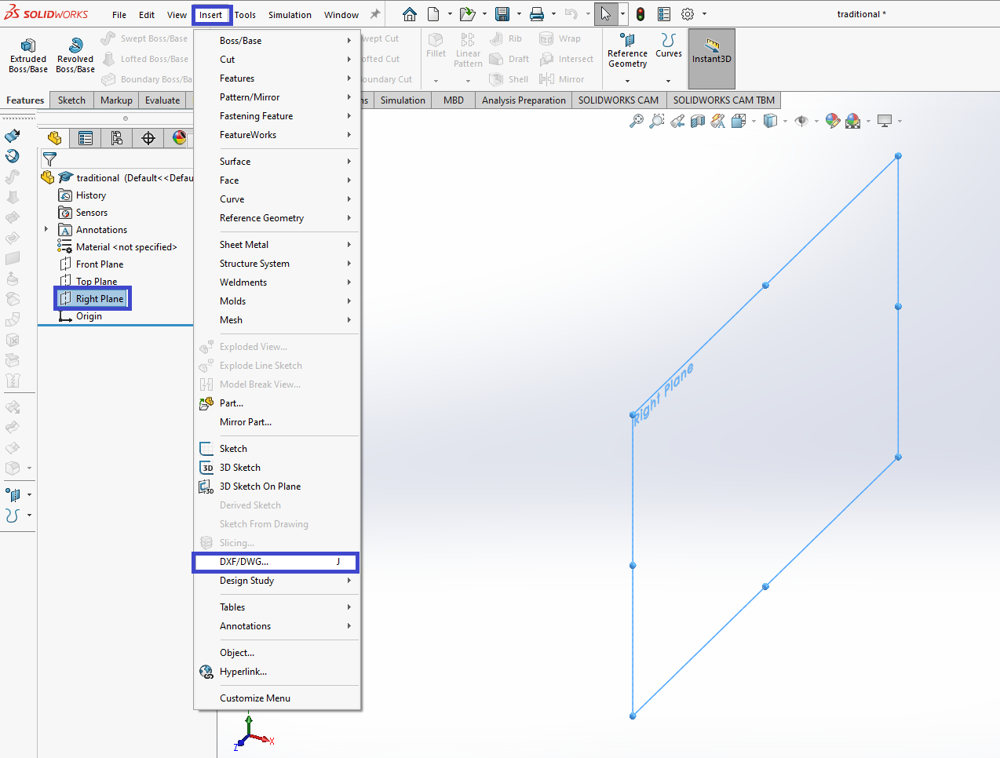

In this case, the file name is traditional_airplane_h_stab_left_AF.dxf.

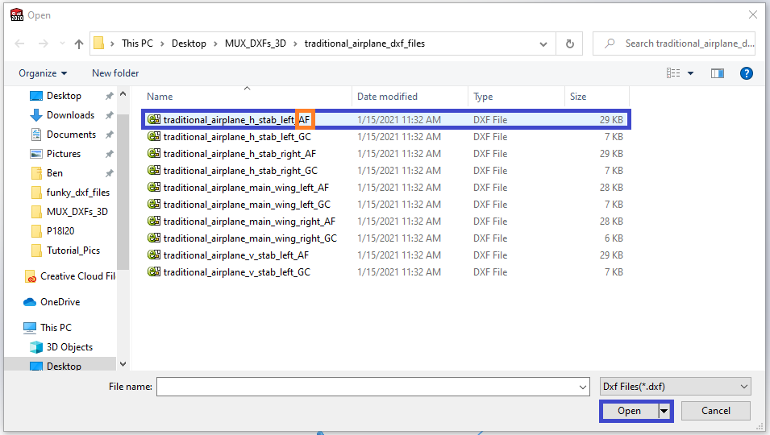

This file must be imported as a 3D file. You can select "Finish" to complete importing the airfoils. However, if you need to change the import units (if the default is not desired), you can select "Next".

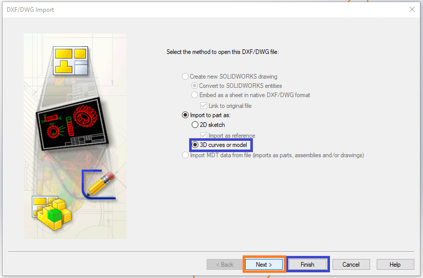

### Changing Units in SolidWorks

Here a dropdown menu can be used to select a different import unit.

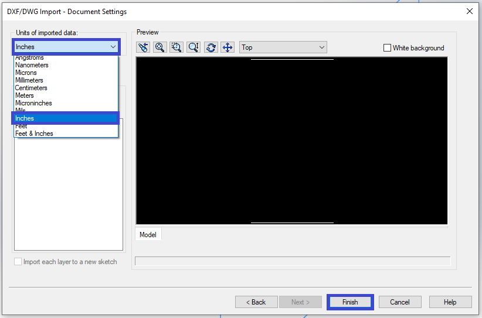

### Create 3D Sketch of Airfoils

After selecting all imported airfoil splines, open a new 3D sketch, and select "Convert Entities". This will make closed shapes for lofting.

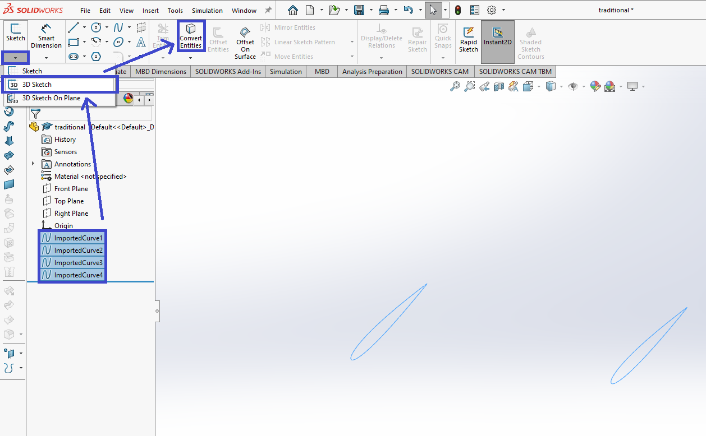

You can now exit the 3D sketch.

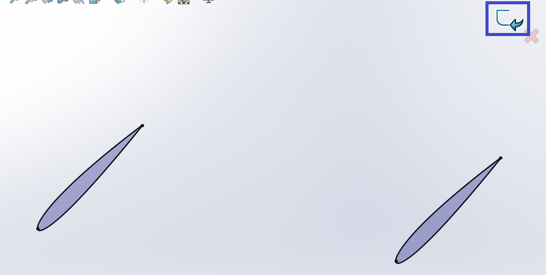

Hiding the imported airfoil curves may help with later visibility and lofting.

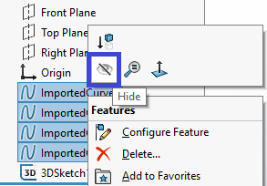

## Import 3D .dxf Guide Curves
Next, you must import the guide curves dxf file exactly as you imported the airfoils file. The guide curves file will have the same wing segment name, with the file name terminating in "_GC". This .dxf file can also be inserted on any plane. 

## Loft
With the airfoils 3D sketch and the guide curves imported, you are ready for lofting.

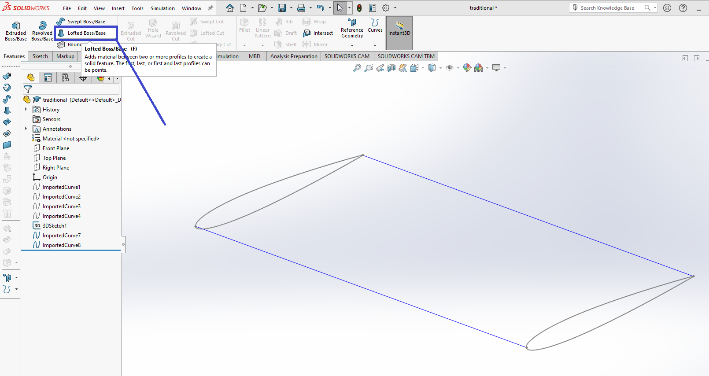

Select the airfoils in order. If a selection menu pops up, use the closed shape option.

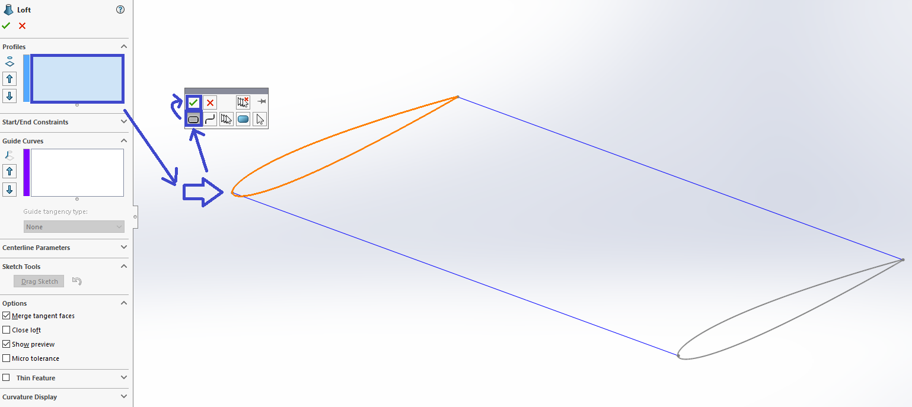

Now, select the guide curves.

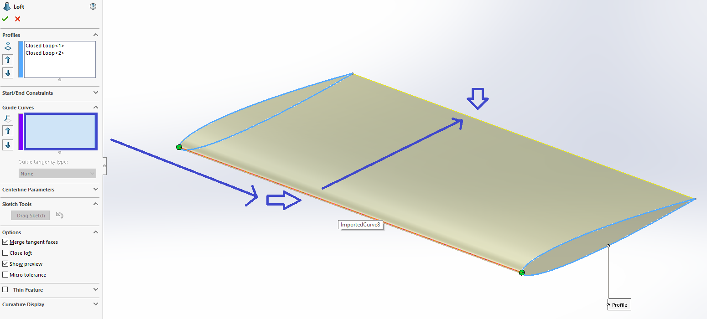

Now, finish the loft.

Success! Good Luck!

## Common Errors

### Problems with Guide Curves
Often, with a complex shape, two guide curves are not enough to constrain the wing geometry through the loft. For more complex lofts, we recommend several guide curves. The number of guide curves can be increased in the .dxf export function. It should be noted that SolidWorks begins to slow down significantly after around forty guide curves. We recommend between four and twenty if two is insufficient. If the loft does not complete, sometimes unselecting certain guide curves may help.

We also recommend an even number of guide curves. This ensures a guide curve is placed at the trailing edge and at the leading edge. Otherwise, the nose of the wing may not loft as desired.

### Zero Chord Locale

If there is at some point along the span your chord is zero, you may notice some errors. When you import the airfoils dxf file for this wing segment you will get an error stating N entities could not be imported (It will be the same as the number of guide curves you have for the dxf export).

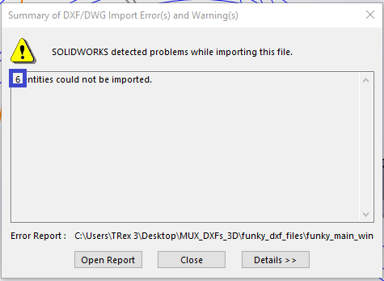

Import the guide curves prior to creating the airfoils 3D sketch. with the 3D sketch open after adding the airfoils, add a point where the chord is zero along the guide curves.

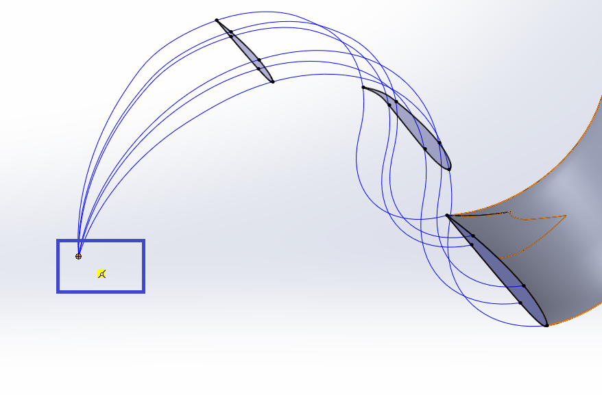

You can use this point similar to the airfoils during the loft. You may notice the absence of an example loft after selecting the point. Once you select all the guide curves, the example loft will appear.

Success! Good Luck!