# Modeling Guide for MachUpX .dxf Files in SolidWorks
There are at three types of files for each wing segment created in MachUpX. How each file is used is described as follows. Alternately, a video tutorial for the whole craft can be found [here](https://youtu.be/szW97Rz5sOU). The files used were generated for a traditional aircraft with a main wing, horizontal, and vertical stabilizers.

## Import Planes
The first file imported is used to create the plane lines.

### Insert Plane Lines
This first file terminates in _planes for the wing segment being modeled. This .dxf file must be inserted on the right plane. Note the plane must be selected prior to selecting Insert > DXF/DWG...

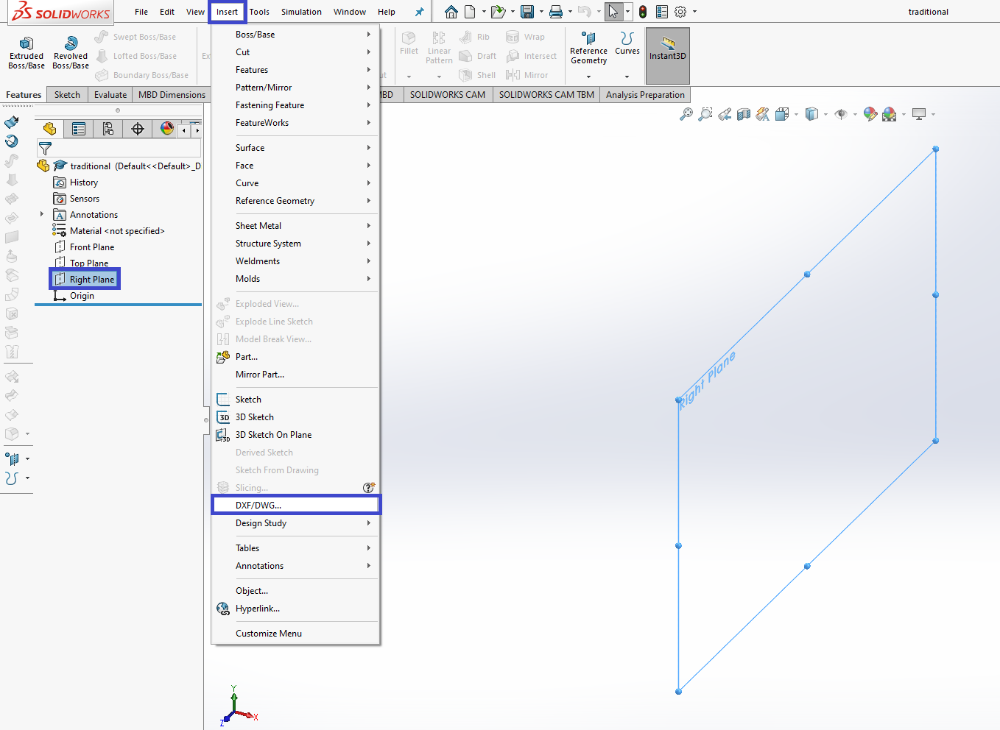

In this case, the file name is traditional_main_wing_right_planes.dxf.

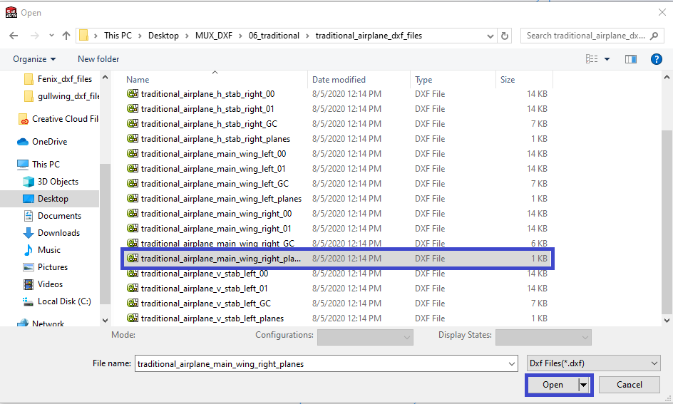

This file must be imported as a 2D file.

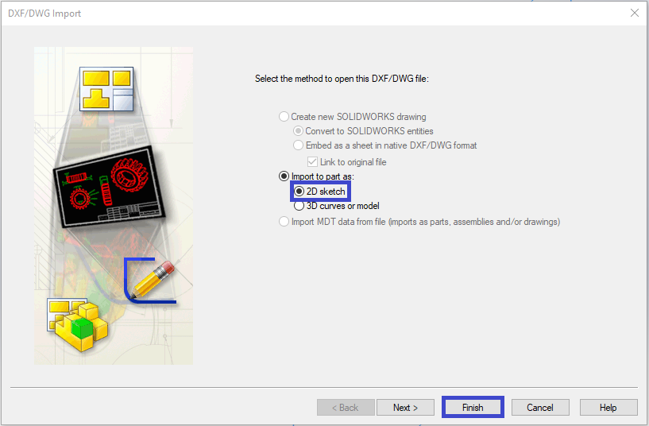

### Changing Units if 'SI' in MachUpX
If you're using SI units in MachUpX, the base unit for all .dxf files created will be meters. If you're using English units, the base unit for all .dxf files is in inches. If you're using English units, you don't need to change the import units.
To modify the units import, move to the next window in the DXF/DWG Import wizard.

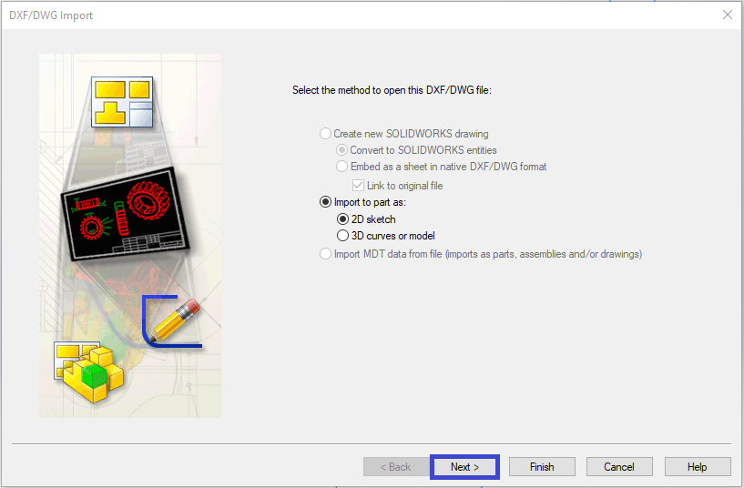

Select meters

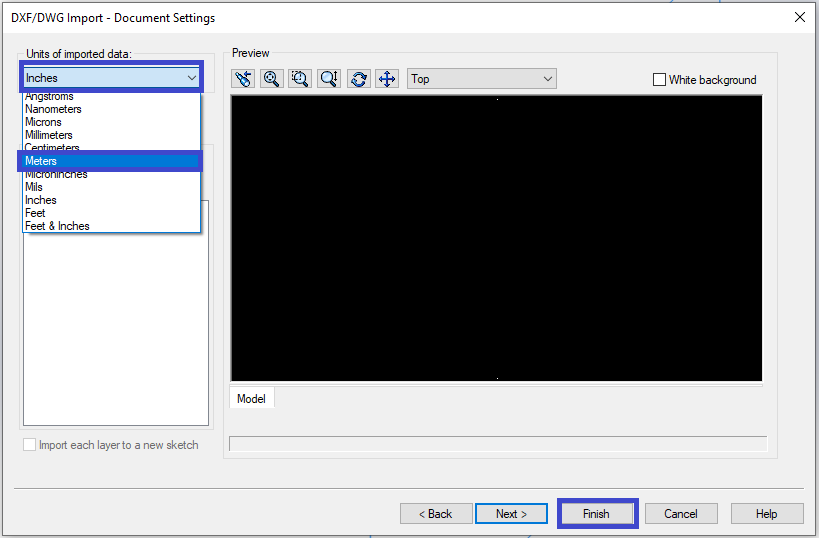

### Create Planes
Beginning near the origin point, select the body of each T, along with the right plane. Insert a plane using these selections. The plane inserted will be coincident with the line, and perpendicular to the right plane.

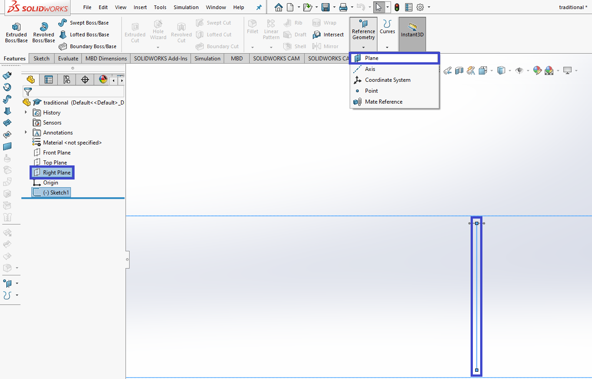

## Import 2D .dxf Airfoils
Next the airfoil outlines must be imported to the planes previously created.

It can help to rename each plane created to _## beginning at 0 at the root / origin plane. The .dxf file to be imported on this first plane (in the image plane_00) is traditional_airplane_main_wing_right_00.

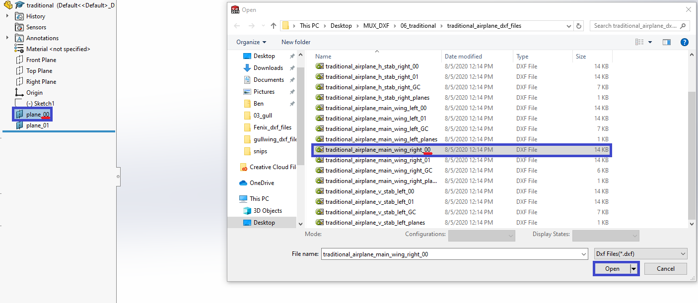

Insert the .dxf shape (as 2D).

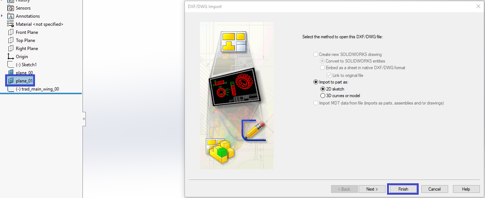

Continue through each plane and related .dxf file. There will be at least 2. The number of these files depends on how many changes in airfoil occur in the wing segement.

## Import 3D .dxf Guidecurves
Lastly, the guidecurves must be imported.

When imported a 3D .dxf file, the plane selected prior does not matter. Import the guidecurves file (traditional_main_wing_right_GC in this example) as a 3D .dxf.

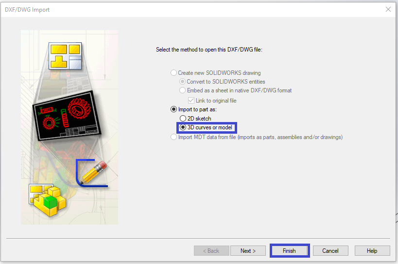

## Loft
Now the loft can be performed

### Loft Point Correlation
As selecting each 2D outline, ensure the loft points relate to the same point on each airfoil. Otherwise, the loft will fail.

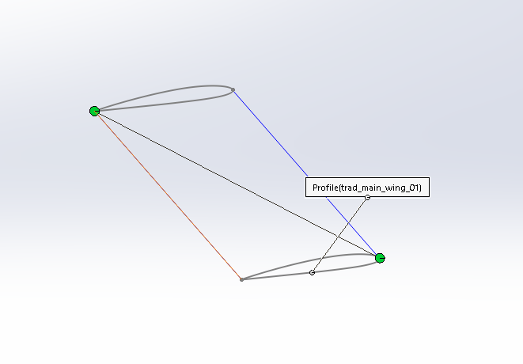

The points must be positioned like so.

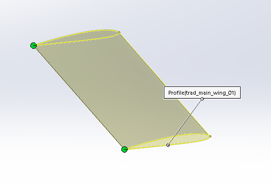

### Loft Complete
Select each outline sequentially, and then each guidecurve.

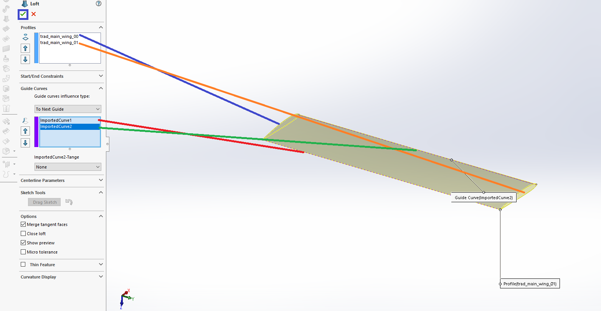

Success! Good Luck!

